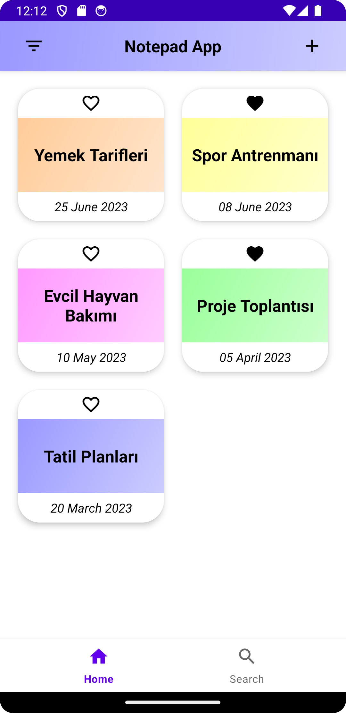
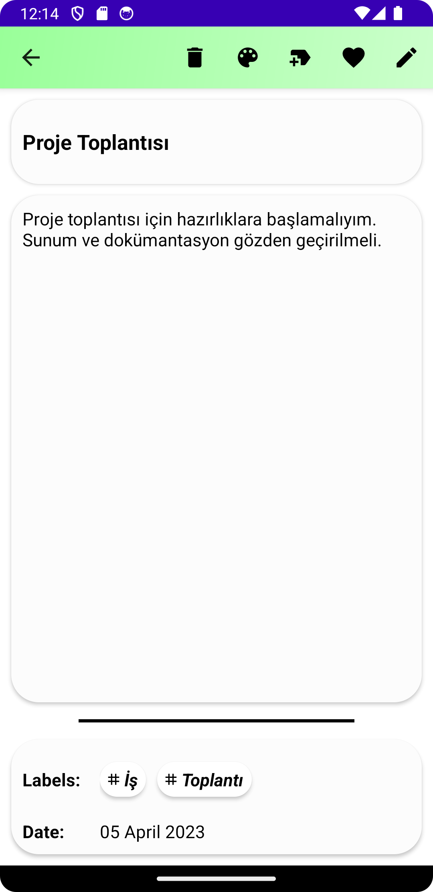
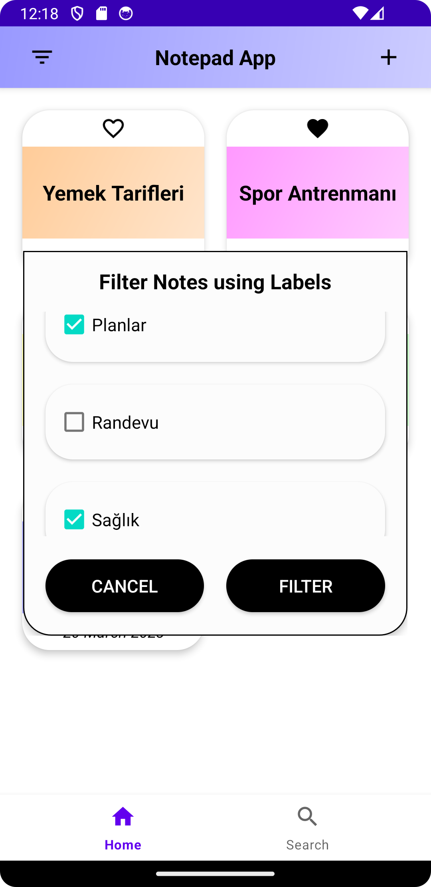
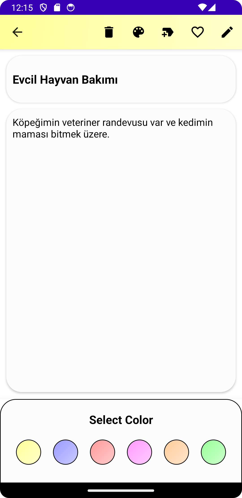
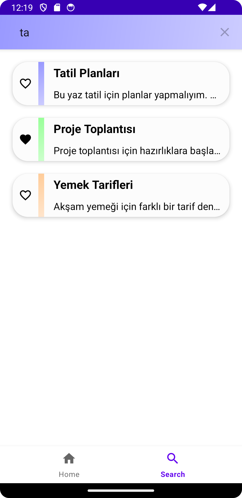
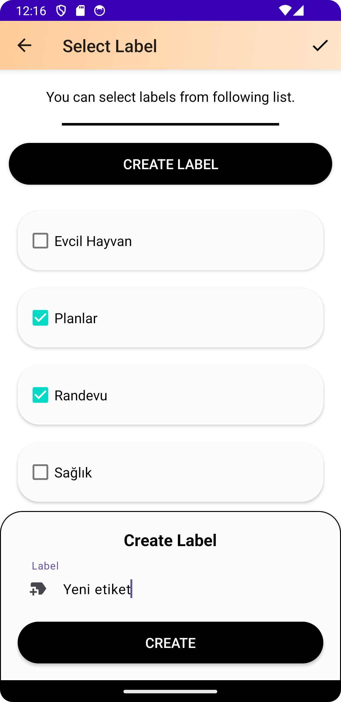

# Android-Notepad-App-Kotlin
Kotlin (MVVM) Android not defteri uygulaması.

---
## Özellikler
* Not ekleme, düzenleme ve silme
* Notları etiketleme ve renklendirme
* Notları arama ve etiketlere göre filtreleme

---
## Uygulama Videosu
https://github.com/samet-ozkan/Android-Notepad-App-Kotlin/assets/55306181/a25ca6a7-65c2-4ac2-92fc-ec7d2ab65165

---
## Kullanılan Teknolojiler
* Room Database
* Coroutine
* Dagger-Hilt
* ViewModel
* LiveData
* ViewBinding

---
## Ekran Görüntüleri
<table>
  <tr>
    <td align="center">Ekran Görüntüsü 1</td>
    <td align="center">Ekran Görüntüsü 2</td>
    <td align="center">Ekran Görüntüsü 3</td>
  </tr>
  <tr>
    <td align="center"></td>
    <td align="center"></td>
    <td align="center"></td>
  </tr>
  <tr>
    <td align="center">Ekran Görüntüsü 4</td>
    <td align="center">Ekran Görüntüsü 5</td>
    <td align="center">Ekran Görüntüsü 6</td>
  </tr>
  <tr>
    <td align="center"></td>
    <td align="center"></td>
    <td align="center"></td>
  </tr>
</table>

---
## İletişim

Email: <a href="mailto:samet-ozkan@outlook.com">samet-ozkan@outlook.com</a>

